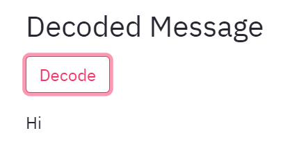

# Quantum Steganography

We are **Team QPower** and this project was made as part of IBM's Creative challenge at QC Hack 2021.

# QPower Team
Syed Farhan Ahmad - A junior Undergrad from India and a Quantum Research Intern at University of California, Los Angeles. Syed Farhan is also the founder of QPower Research Community.

Anush Krishna - An undergrad from PSG CAS and a Microsoft Student Ambassador for the Asia region. Anush is also a member of QPower Community and the winner of Qiskit challange at MacHacks 2021. Developed the web application to visualise the Quantum Steganography

Shaun Radgowski - A senior undergrad at Yale and member of YQI (Yale Quantum Institute). Shaun published a redesign of QAOA's underlying cost function for Quantum ML as his senior thesis.

Chad Palmer - A junior undergrad at Yale majoring in Mathematics and Computer Science. Chad is an avid programmer and has served as a TA for multiple Yale Computer Science classes.

Mohamed Yassine Ferjani - A senior undergrad from Tunisia and co-founder of QTunisia quantum community, he is conducting wokshops and webinars on quantum computing. Mohamed is the winner of the Qiskit Global Hackathon. He is currently working on his senior thesis on quantum algorithms.

## Project Idea

We have implemented Quantum Steganography using qiskit in this project.   

The idea is to encode the sender's text(secret message) using the concept of interference. The secret message is encoded based on the cover file(a text sentence in this case). An interactive working implementation is available here: [https://qc-hacks.herokuapp.com/](https://qc-hacks.herokuapp.com/). 

We have chosen our cover file and the secret message to be in text formats to make it easier for new learners to understand the concept of quantum steganography while also trying it out interactively in a console. 

## Implementation Details

The encoder circuit is based on 7 qubits but our interactive application has an option to create circuits based on the number of qubits selected and view them instantaneously.  

Here are some steps to interactively play with our application:

1. Choose the number of qubits using the slider. We would suggest that you choose 7 for the encoding and decoding scheme to work flawlessly. You can also test out other number of qubits to view the generated circuit.  

2. Enter the Secret message and press enter. You could try out *qiskit* as one of the test words.  

  
Here, you can also view the generated circuit.

3. Upload a sentence where you wish to hide your message and press enter. You could try this sentence *hellooo worlddd hellooo worlddd hellooo worlddd*, a bit too dramatic to be a sentence, but it works. We are fixing our backend to support all sentence types.   
In this image, I have used *Sophisticated Superconductors* as the short sentence and it works.  

  

4. Click of encode to view the encoded message and then click on decode to finally view your original message.  

  

You can now play around with this tool and chat with your friends using **Quantum Steganography**. Isn't it cool?

